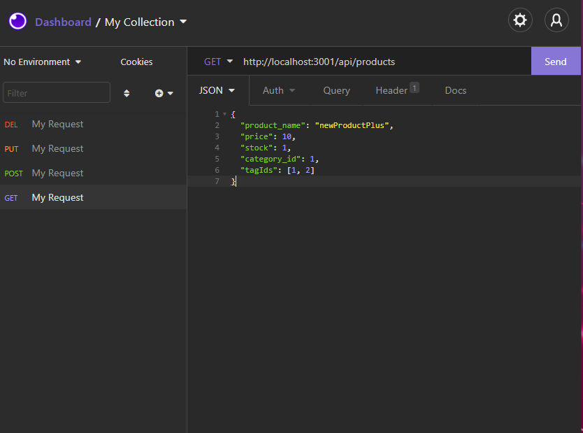
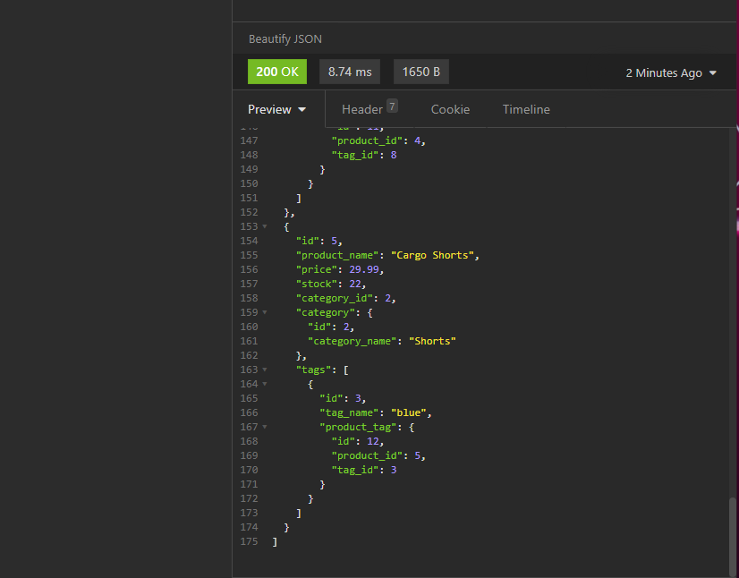

# homework-13-ecommerce-backend

## Description
This application is a database bvackend for a mock e-commerce site. The app uses pre-generated items with various tags that are seeded into the schema. Users can also add, update, and delete their own products, tags, and categories. This application uses Sequelize.js to make SQL queries easy to generate. 

## Video Demonstration

https://watch.screencastify.com/v/LrnvIT5XwEgnw7tQfHpR

## Operations
1. Initialize the database
    a. create a .env file and populate with a DB_USER, DB_PW, and DB_NAME (npm dotenv will take this information)
    b. run MySQL <source ./db/schema.sql>
    c. exit MySQL
    d. <npm run seed> to seed the database with pre-generated products
2. Start the server
    a. <npm start>
    b. testing db requires some REST API tester such as Insomnia
3. Naviagate to http://localhost:3001/api/*insert desired route here*
4. GET, POST, PUT, and DELETE routes all available for Products, Tags, and Categories

## Tech/Framework
Built with:
    * JavaScript
    * SQL
    * Express.js
    * NPM: express, mysql2, sequelize, dotenv, nodemon
    * Node.js
    * Insomnia rest API tester

## Authors and Acknowledgment
* Nick Skinner
* I'd like to thank the UC Davis coding bootcamp team for answering all my questions regarding this project.

## License
Copyright [2021] [##Authors]

Licensed under the Apache License, Version 2.0 (the "License");
you may not use this file except in compliance with the License.
You may obtain a copy of the License at

    http://www.apache.org/licenses/LICENSE-2.0

Unless required by applicable law or agreed to in writing, software
distributed under the License is distributed on an "AS IS" BASIS,
WITHOUT WARRANTIES OR CONDITIONS OF ANY KIND, either express or implied.
See the License for the specific language governing permissions and
limitations under the License.